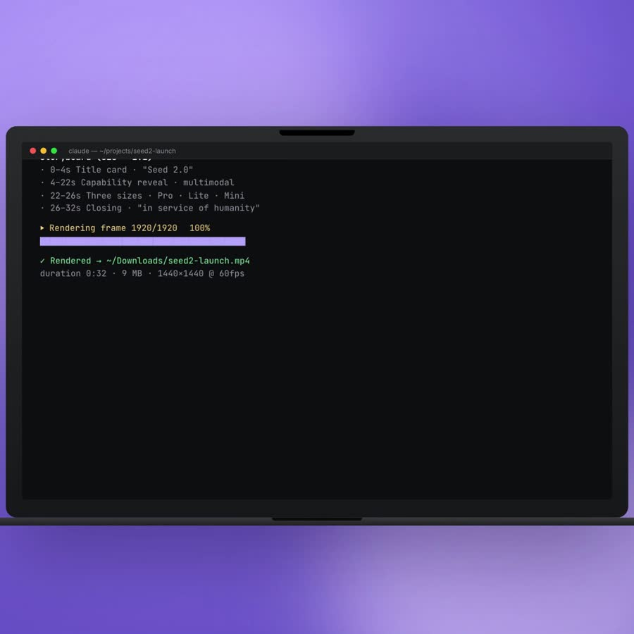

# polym-explainer-video

A [Claude Code](https://claude.ai/code) skill that turns any product input — a doc, a webpage, a GitHub repo, or just an idea — into a launch-quality explainer video. One prompt in, polished MP4 out.

---

## Overview

A 30-second demo of the skill in action, captured live as it produces a launch video. The user types a prompt; the skill drafts a storyboard, asks for approval, then renders a 1:1 square video with synced music in about 3 minutes.

https://github.com/encircleacity2/bobyte-explainer/blob/main/assets/demos/demo.mp4



### How to use

In your Claude Code session, paste one of:

| You have | What you say |
|---|---|
| A **product page / docs URL** | *"Make an explainer video for [https://example.com](https://example.com)"* |
| A **Lark / Feishu doc** | *"Turn this Lark doc into a launch video: [doc URL]"* |
| A **GitHub repo** | *"Produce a Shorts video for this GitHub repo: [repo URL]"* |
| **PDFs + screenshots** | *"Make an explainer from these files"* (attach them) |
| **Just an idea** | *"Make a 30s video about [describe the product]"* |

The skill handles everything from intake → storyboard → render → music → delivery. A typical 30-45s video lands in `~/Downloads/` in under 5 minutes at $0–$0.20 in API cost.

---

## Feature highlights

### 🎬 Pure-B-roll mode — no presenter required
The default for product launches. Polished motion + UI + typography + music — no talking head, no portrait photo needed at onboarding. Saves ~80% of cost vs hybrid mode and produces the OpenAI/Apple-style aesthetic modern product videos use.

### 📐 Pick your distribution channel upfront
Phase 1 asks where the video will live and chooses the right aspect ratio + duration sweet spot automatically:

| Channel | Aspect | Sweet-spot duration |
|---|---|---|
| X / LinkedIn / IG feed | 1:1 (1440×1440) | 30–60s |
| TikTok / Reels / Shorts | 9:16 (1080×1920) | 21–34s |
| YouTube / website hero | 16:9 (1920×1080) | 60–180s |

### 🎨 5 built-in design presets (or bring your own brand)
- **`openai-clean`** — geometric bold sans + lavender liquid + minimal
- **`anthropic-warm`** — warm earth tones + serif italic + editorial
- **`linear-minimal`** — dark mode + neon accents + technical
- **`apple-keynote`** — deep black + hero typography + cinematic
- **`brand-bold`** — high-contrast + oversized type + color-block

Each preset ships a real `design.md` with full tokens (palette, typography, motion easings, scene recipe). Or paste your own `design.md` and the skill renders against your brand.

### 📖 Storyline as a first-class concept
The skill enforces an 8-pattern narrative discipline before any render runs — protagonist with a real name (not "the user"), a small canon of specific entities preserved across frames, a central artifact that echoes across multiple beats, etc. The built-in auditor blocks "screen catalogue" storyboards (a sequence of UI shots with no story) — the #1 reason finished videos don't communicate.

### ✋ 3-option approval gate, in your language
After drafting the storyboard, the skill shows it inline and asks you in your conversation language: **Approve / Suggest changes / Stop**. No render runs on "looks good 👍". If you suggest changes, the model revises and re-presents — looping until you click approve or stop.

### 🔍 7 validators with auto-fix loop
Before render and after, a unified `verify.py` runs 7 validators (storyboard audit / overlap / asset existence / camera overflow / render-spec match / audio levels / pixel-edge bleed). Auto-fix mechanically repairs the safe subset (cap camera scales, re-encode keyframes, re-mix audio gain, deconflict tracks) and re-verifies up to N iterations.

### 🎞️ 60fps render by default
Every video renders at 60fps `--quality high` — visibly smoother than the 30fps default most tools settle for. Motion follows a "house style" reference that bans linear easings and codifies entrance / exit / camera curves so motion craft stays consistent across compositions.

### 🎵 Optional AI background music
If enabled at onboarding, the skill generates a custom instrumental via Volcengine's music API per video (matching the storyboard's mood), then sidechain-ducks against any voice. Cost: ~$0.20 per track. Disable entirely if you prefer to add music yourself.

### 🤖 A-roll digital human (optional, hybrid mode)
For personal-brand videos where you want to appear on camera: hybrid mode generates a Seedance 2.0 AI talking-head from your portrait photo + reference voice clip, then composes it with B-roll. Skip this mode for product launches — it's not needed and adds cost.

---

## Step-by-step usage

### Install once

```bash
git clone https://github.com/encircleacity2/bobyte-explainer.git \
  ~/.claude/skills/polym-explainer-video
```

Restart your Claude Code session — the skill is auto-discovered.

### First run: ~3-minute onboarding

The first time you trigger the skill, it walks you through a one-time setup that writes `~/.explainer-video/config.json` (mode 600). Two paths:

- **Credential file (fast)** — fill in a copy of [`credentials.template.md`](credentials.template.md) and paste its path. The template is designed to be emailed to teammates so each person onboards in one step.
- **Step-by-step** — the skill prompts for each item interactively, in your conversation language.

It collects:

1. **Output folder** — where finished videos land (default `~/Downloads`)
2. **AI background music — yes / no** — if yes, Volcengine music AK / SK
3. **BytePlus ModelArk + IAM keys** — *only if you plan to use hybrid mode* (avatar A-roll)
4. **Personal portrait photo + reference video** — *only if you plan to use hybrid mode*

Pure-broll users only need steps 1–2 to start producing videos.

### Per-task workflow (every video)

Once onboarded, each new video walks through 5 phases:

```
┌──────────┐   ┌──────────┐   ┌──────────┐   ┌──────────┐   ┌──────────┐
│ Phase 1  │ → │ Phase 2  │ → │ Phase 3  │ → │ Phase 4  │ → │ Phase 5  │
│ Intake + │   │ Restyle  │   │Storyboard│   │Production│   │ Deliver  │
│Preflight │   │(skipped) │   │+ Approval│   │ + Verify │   │  MP4     │
└──────────┘   └──────────┘   └──────────┘   └──────────┘   └──────────┘
```

**Phase 1 — Intake + Preflight (~30s)**
The skill parses your input (URL, file, description) into a brief, then asks 3 questions in your conversation language:
- **Mode** — pure-broll-product-demo (default) / hybrid / aroll-only
- **Visual identity** — your own `design.md`, or one of the 5 built-in presets
- **Distribution channel** — X / TikTok / YouTube / multi-channel

**Phase 2 — Portrait restyle (skipped in pure-broll)**
Only runs in hybrid mode. Seedream 4.5 generates 4 portrait variants (new outfit / setting / lighting); you pick one or skip.

**Phase 3 — Storyboard + approval (~1–2 min of model work + your review)**
The skill drafts the storyboard in 9 mandatory steps (Cast → Canon → Echo → Narrative answers → Frame names → Narration cues → Click chain → arc_map → then segments). Runs the pre-render auditor to catch structural issues. Presents the storyboard inline in your conversation language with **3 options**: Approve / Suggest changes / Stop.

**Phase 4 — Production (~3–5 min)**
- Auto-installs any HyperFrames registry blocks the storyboard references
- Generates the composition HTML from storyboard + chosen style preset
- Renders at 60fps `--quality high`
- Generates Volcengine music if enabled
- Mixes (sidechain ducking under any voice)
- Runs post-render `verify.py` — audio level adjustments auto-applied

**Phase 5 — Deliver**
Saves the MP4 to your configured output folder. Reports duration, size, path. Optionally uploads to Lark with explicit confirmation.

### A typical session timeline

| Time | What's happening |
|---|---|
| 0:00 | You: *"Make an explainer video for [URL]"* |
| 0:30 | Skill presents preflight questions; you pick mode / style / channel |
| 1:00 | Skill drafts storyboard, runs auditor, presents inline |
| 2:00 | You hit **Approve** |
| 3:30 | HyperFrames render complete (1440×1440 @ 60fps) |
| 4:30 | Music generated + mixed |
| 5:00 | Final MP4 in `~/Downloads/` |

---

## Technical

### Architecture

```
~/.claude/skills/polym-explainer-video/
├── SKILL.md                # 5-phase orchestration spec
├── references/             # 15 reference docs (load on demand)
│   ├── narrative-arc.md    # 8 storyline patterns + 5-beat arc (READ FIRST)
│   ├── motion-house-style.md  # easings, fps, duration windows
│   ├── storyboard-format.md   # full storyboard.json schema
│   ├── style-presets.md       # when-to-use guide for the 5 presets
│   ├── channel-aspect-ratios.md  # platform × aspect × duration matrix
│   ├── hyperframes-catalog.md    # curated registry block subset
│   ├── caption-components.md     # registry caption picker
│   ├── screen-script-format.md   # in-device screen HTML scripting
│   ├── meta-output-beat.md       # opt-in pattern for video products
│   ├── agent-list.md             # known AI coding agent brand info
│   ├── seedance-api.md           # A-roll API (hybrid mode only)
│   ├── seedream-api.md           # Portrait restyle API
│   ├── volcengine-music-api.md   # Music generation API
│   ├── production-techniques.md  # Compose / slice / concat / mix
│   └── ...
├── scripts/                # 16 helpers
│   ├── verify.py           # unified validator + auto-fix loop
│   ├── audit_storyboard.py # storyboard auditor
│   ├── compose_and_render.py  # Phase 4 orchestrator
│   ├── synthesize_screen_ui.py # LLM-synth in-device screens
│   ├── fetch_registry.py   # HyperFrames registry cache
│   └── ...
├── templates/              # reusable recipe scaffolds
│   ├── openai-product-demo.json  # canonical pure-broll recipe
│   └── agent-chip-row.html       # named-agent opening pattern
├── assets/
│   ├── style-presets/      # 5 built-in design.md preset files
│   ├── hyperframes-template.html  # composition scaffold
│   └── macos-window-chrome.html   # reusable macOS window UI
└── credentials.template.md # onboarding template (fill + email)
```

### Tools the skill uses

- **[HyperFrames](https://hyperframes.heygen.com)** — the renderer. HTML compositions with GSAP timelines compile to deterministic MP4 via headless Chrome. Free, local, registry of 80+ blocks.
- **Seedance 2.0** (BytePlus ModelArk) — A-roll digital human generation (hybrid mode only)
- **Seedream 4.5** (BytePlus) — Portrait restyle (hybrid mode only)
- **Volcengine music API** — AI background music
- **ffmpeg** — mixing, level adjustment, slicing, post-render verification

### Requirements

- **Node 18+** and npm (HyperFrames renderer)
- **Python 3.11+** (audit + verify scripts)
- **ffmpeg** (compose, mux, audio level adjustments)
- **Chrome / Chromium** (headless render — managed by HyperFrames automatically)

Optional (only for specific features):
- **BytePlus ModelArk + IAM keys** — hybrid / aroll-only modes
- **Volcengine music keys** — AI background music
- **`lark-cli`** — Lark/Feishu doc ingestion or upload
- **Anthropic API key** — `synthesize_screen_ui.py` for in-device UI synthesis (has no-LLM fallback)

Python packages installed as needed:
```bash
pip install --user requests Pillow volcengine anthropic librosa
```

### Pre-render and post-render validation

The skill runs `scripts/verify.py` automatically at two points:
- **Pre-render** — after composition generation, before the (slow) render. Catches storyboard issues + asset issues + lint errors. Auto-fix repairs safe issues (cap camera scales, deconflict tracks, etc.) and re-runs.
- **Post-render** — after the MP4 is produced. Pixel-based overflow detection, render-spec match (resolution/fps/duration vs declared), audio levels in mode-target range, no clipping.

Severe issues block delivery; warnings surface in the report but don't auto-block.

### What you can customize

| Layer | How |
|---|---|
| **Brand** | Pick a built-in preset, or paste your own `design.md` |
| **Aspect ratio** | Phase 1 question — picks defaults per channel |
| **Mode** | pure-broll-product-demo / aroll-broll-hybrid / aroll-only |
| **Storyboard** | Drafted by the model; you approve / change / stop |
| **Length** | Recommended per content profile + channel sweet spot |
| **Recipe** | Drop a new `templates/<name>.json` to add a recipe; auditor enforces the schema |
| **Adding a new design preset** | `assets/style-presets/<name>/design.md` |
| **Adding a known agent** | Append to `references/agent-list.md` (brand color + logo hint) |

### Changelog + smoke tests

- [`CHANGELOG.md`](CHANGELOG.md) — full per-PR history of changes
- [`SMOKE_TEST.md`](SMOKE_TEST.md) — per-feature test commands

### License

MIT
